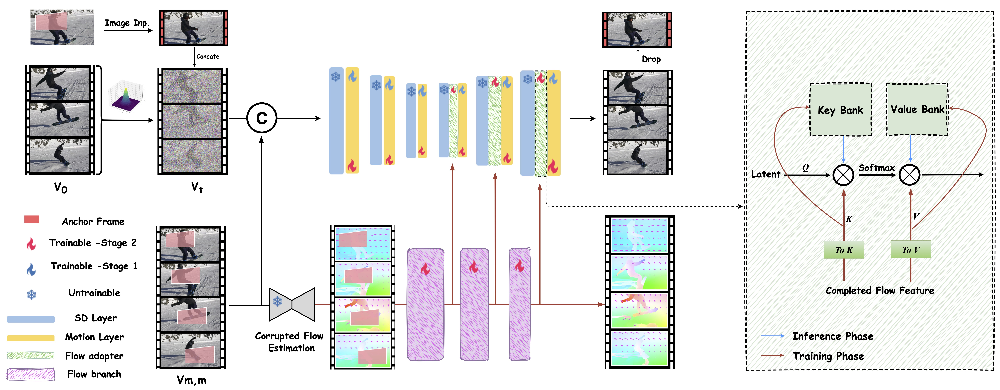
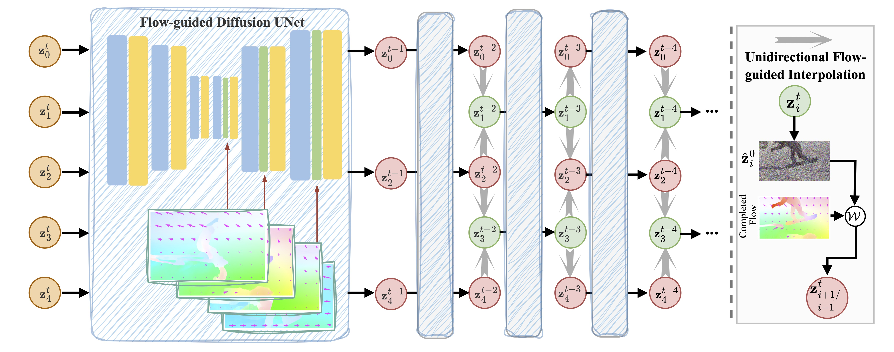

# FloED: Advanced Video Inpainting Using Optical Flow-Guided Efficient Diffusion

## Publication Title

**FloED**: Advanced Video Inpainting Using Optical **Flo**w-Guided **E**fficient **D**iffusion

### Authors

- Bohai Gu1, 2, Hao Luo2*, Song Guo1*, Peiran Dong1

1 Hong Kong University of Science and Technology  
2 Alibaba Group  
* Co-Corresponding authors  

### Links

- [**Paper (PDF)**](https://arxiv.org/pdf/2412.00857)
- [**arXiv Page**](https://arxiv.org/abs/2412.00857)

---

## Abstract

Recently, diffusion-based methods have achieved great improvements in the video inpainting task. However, these methods still face many challenges, such as maintaining temporal consistency and addressing time-consuming issues. This paper proposes an advanced video inpainting framework using **optical flow-guided efficient diffusion**, called **FloED**.

Specifically:

- FloED employs a **dual-branch architecture**, where a flow branch first restores corrupted flow, and a multi-scale flow adapter provides motion guidance to the main inpainting branch.
- A **training-free latent interpolation method** is proposed to accelerate the multi-step denoising process using flow warping.
- Additionally, introducing a **flow attention cache mechanism**, FloED efficiently reduces the computational cost brought by incorporating optical flow.

Comprehensive experiments in both background restoration and object removal tasks demonstrate that **FloED outperforms state-of-the-art methods** in terms of both performance and efficiency.

---

## Method Overview

Our method employs a **dual-branch architecture** implemented through a two-stage training approach:

1. **Motion Layer Optimization**: Focus on optimizing the motion layer in the upper branch to adapt specifically to the video inpainting domain.
2. **Flow-Guided Inpainting**: Use a dedicated flow branch complemented by a **multi-scale flow adapter**, which provides flow guidance covering upblocks of the primary UNet. During inference, efficiency is enhanced through a **flow attention cache**.
3. **Training-Free Latent Interpolation**: Use optical flow to speed up the multi-step denoising process. Combined with the flow attention cache mechanism, this reduces additional computational costs introduced by the flow.

---

## Qualitative Results

### Background Restoration

**Comparison on Background Restoration**  

- **Results**:
  -
